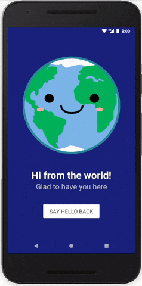

<h1 align="center">Literally Hello World</h1>

Hit that button and say "Hi!" to the world. This is my very first app 😃🎉

 

</img>

<h2>About</h2>
First of four student projects made in 2017-2018 as part of [Udacity's Android Basics Nanodegree](https://eu.udacity.com/course/android-basics-nanodegree-by-google--nd803).

----------

<h3>☑️ Phase 1 - (Nov. - Feb.):</h3>

1. [**Literally Hello World**](https://github.com/r4dixx/LiterallyHelloWorld)
2. [Hello Android](https://github.com/r4dixx/HelloAndroid)
3. [Cheesy Winter Contest](https://github.com/r4dixx/CheesyWinterContest)
4. [m32O](https://github.com/r4dixx/m32O)

----------
<h3>⏳ Phase 2 - (Feb. - Aug.):</h3>

*In progress*
<h2>Goal</h2>
<h2>Key learnings</h2>
<h2>Getting Started</h2>
1. [Download this project as zip](https://github.com/r4dixx/LiterallyHelloWorld/archive/master.zip)
2. Extract the zip file
3. Open Android Studio
4. Import the project 
5. Realize that's way too long already (for such a simple app)
6. Use `dryrun` by @cesarferreira 😉👉  github.com/cesarferreira/dryrun
<h2>Contributing</h2>
<h2>Created by</h2>
<h2>Acknowledgements</h2>
<h2>License</h2>
