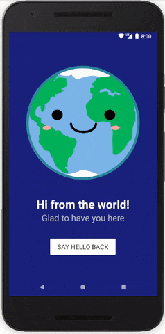

<h1 align="center">Literally Hello World</h1>

<strong>Hit that button and say "Hi!" to the world.</strong>
 This is my very first app 😃🎉

 

</img>

<h2>About</h2>
First of eight student projects made in 2017-2018 as part of <a href="https://eu.udacity.com/course/android-basics-nanodegree-by-google--nd803" target="_blank">Udacity's Android Basics Nanodegree</a>.

<h3>☑️ Phase 1 - (Nov. - Feb.):</h3>

1. <a href="https://github.com/r4dixx/LiterallyHelloWorld"><strong>Literally Hello World</strong></a>
2. <a href="https://github.com/r4dixx/HelloAndroid" target="_blank">Hello Android</a>
3. <a href="https://github.com/r4dixx/CheesyWinterContest" target="_blank">Cheesy Winter Contest</a>
4. <a href="https://github.com/r4dixx/m32O" target="_blank">m32O</a>

<h3>☑️ Phase 2 - (Feb. - Jul.):</h3>

 1. <a href="https://github.com/r4dixx/RookiePlayer">Rookie Player</a>
2. <a href="https://github.com/r4dixx/VisitCalgary">Visit Calgary</a>
3. <a href="https://github.com/r4dixx/TheGuardianView">The Guardian View</a>
4. <a href="https://github.com/r4dixx/Flourish-And-Blotts-Book-Registry">Flourish & Blotts - Book Registry</a>

<h2>Goal</h2>

Draw a card wireframe and implement it in XML. It should be simple and clear and shouldn't have fixed widths or heights.

<h2>Top 5 key learnings</h2>

- Layout weights
- App translation
- Landscape support
- LDPI support
- RTL support

Project has been improved at the end of Phase 1 given the new learnings acquired then.

<h2>Installation</h2>

1. Download this project as zip and extract it
2. Import it in Android Studio
3. Sync Gradle and run on your device/emulator

Or use <a href="https://github.com/cesarferreira/dryrun" target="_blank">`dryrun`</a> by <a href="https://github.com/cesarferreira" target="_blank">@CesarFerreira</a>

<h2>Contributing</h2>
No contributions can be made. Project archived.

<h2>Project status</h2>
Closed.

<h2>Credits</h2>

- Author: <a href="https://twitter.com/r4dixx" target="_blank">Amaël Sikel</a>
- Illustration created by <a href="https://openclipart.org/detail/271128/kawaii-earth" target="_blank">mvolz</a>
- Colors from <a href="https://material.io/guidelines/style/color.html#color-color-palette" target="_blank">the official Material palette

<h2>Copyright</h2>
This project is licensed under the terms of the MIT license and protected by Udacity Honor Code and Community Code of Conduct. See <a href="LICENSE.md">license</a> and <a href="LICENSE.DISCLAIMER.md">disclaimer</a>.
